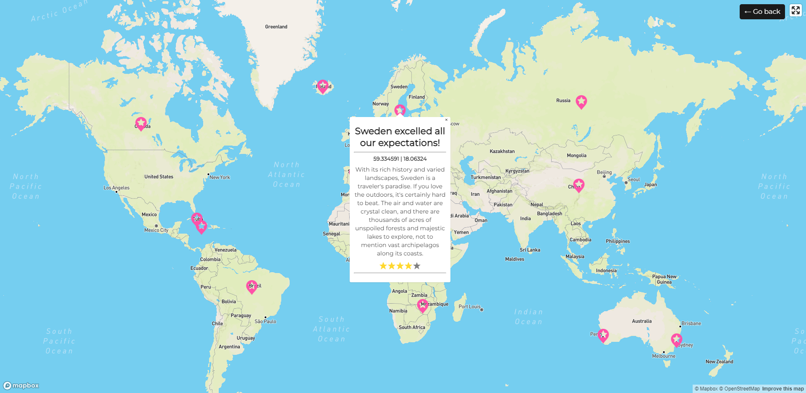
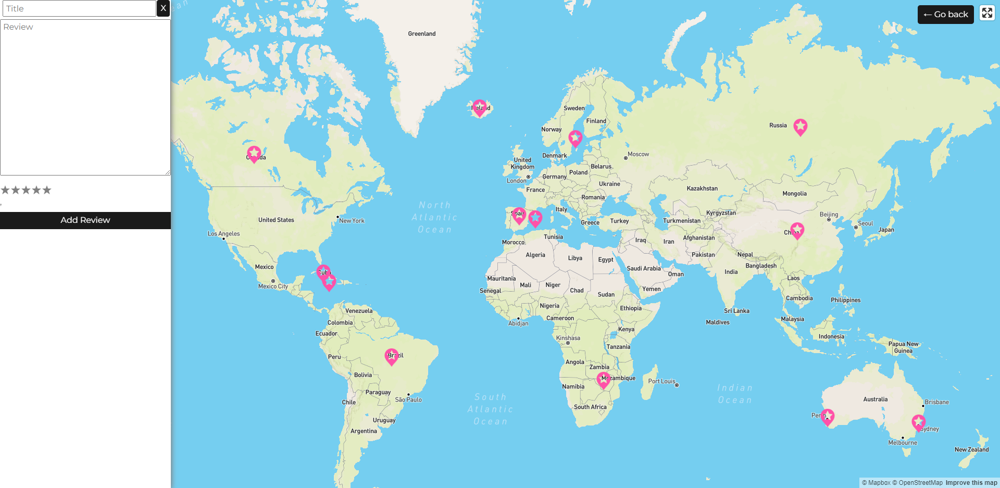

# ✈️ WanderView ✈️
<a href="https://wanderview.herokuapp.com/"></a>   

## Description
A MERN powered application created for users to view and add reviews on locations all over the world, allowing users to share their experience about a holiday destination by simply clicking a location on the map, adding their review and star rating to generate a pin drop.

## Technologies
```
- MongoDB
- Express.js
- React
- NodeJS
- JWT
- GraphQL
- Mongoose
- Mapbox/React-Map-GL
```
## Table of Contents
  - [Description](#description)
  - [Installation](#installation)
  - [Usage](#usage)
  - [Contribution](#contribution)
  - [License](#license)
  - [Questions](#questions)
  - [Credits](#credits)

## Installation
Clone the Github repository:<br>
`https://github.com/LizMackle/WanderView.git`

Install all dependencies required for application:<br>
`npm install` from the root directory.
  
## Usage
To use this app, use the following command:

Seed the app<br>
`npm run seed`

Start the server<br>
`npm run develop`
  
### [Deployed App](https://wanderview.herokuapp.com/)





## Contribution
Please feel free to contribute in any way by forking the repo and creating a pull request.

## License
This project is using the MIT license.

## Questions❓
If you have any questions, please contact Liz via [Email](mailto:liz.mackle@outlook.com) or [GitHub](https://github.com/LizMackle).

## Credits
This app was created by [Mayra Rivas Lara](https://github.com/MayraRivasLaray) | [Liz Mackle](https://github.com/LizMackle) | [Tahlia La Galia](https://github.com/tahlialg) 
